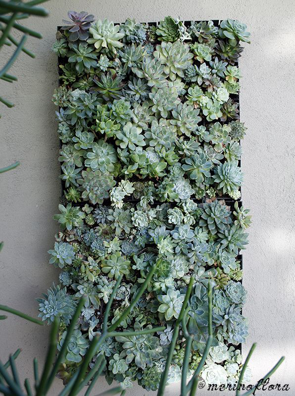

# A Toplevel Section Is A Title Slide

## A Second-Level Section

This will make a header for a content slide.

See the `--slide-level` option for more information.[^1]

************
  
  We can start a new slide without a section break, using a horizontal
rule (usually a row of asterisks).

These features follow those described in the
[presentation section][presentations] of the [pandoc manual][manual]

[presentations]: http://pandoc.org/MANUAL.html#producing-slide-shows-with-pandoc
[manual]: http://pandoc.org/MANUAL.html#producing-slide-shows-with-pandoc

Those were links, produced using one of the standard markdown formats.

## Inline formatting

The standard inline formatting works here:
  
  Here are examples of *italics*, **bold**, and ***bold italics***.

Here is ~~strook-three~~ strike-through and [small caps]{.smallcaps}.

We can also do subscripts (H~2~0) and super^script^.

<!-- Comments don't show up. -->

Here is a footnote.[^2]

## Math Equations

Equations can be written in LaTeX and can go either inline,
$e^{i\pi} +1 = 0$, or in display format:

$$\nabla \cdot \vec{E} = \frac{\rho}{\epsilon_0}$$

or an array of equations:

$$
\begin{eqnarray}
\nabla  \cdot \vec{B} &=& 0 \nonumber \\
\nabla  \times \vec{E} &=& - \frac{\partial B}{\partial t} \nonumber \\
\end{eqnarray}
$$

## Lists

- Bulleted bulleted lists.

- And go to aribtrary depth.

- Like this

+ Or this

- Back to here.

## Lists (continued)

Lists can also be numbered:

1. Tomatoes

2. Potatoes of various sorts

a. sweet potatoes

b. russet potates

3. Tornadoes, for the rhyme.

## Some Code

At the moment, there is no syntax highliting for code, but that is
forthcoming.

~~~
rCode <- putitHere
doSomething(withit)
~~~

## And a Blockquote:

Someone once said:

> Maecenas ex quam, elementum vel augue in, dignissim pellentesque
> enim. Nunc sed dignissim sem, eget semper metus. Ut faucibus dolor ac
> nunc blandit, non egestas risus consequat. Quisque sodales erat sed
> nisi condimentum cursus. Maecenas egestas varius magna. Morbi at arcu
> at libero dictum facilisis ac nec tellus. Nam id dignissim est, vitae
> volutpat tellus. Quisque vitae lorem congue, interdum leo vitae,
> gravida tellus. Curabitur nulla neque, rhoncus eu erat sit amet,
> malesuada elementum nisl. Praesent pretium turpis in dignissim
> pretium.

# Images and Tables

## Some things to know

- Images and tables always create new slides (there would be no way to
place them properly with text boxes of arbtrary length.)

- They can both have slide headers (made using second-level headers in
markdown) and captions.

- Captions may include links.

- Images may be pulled from the local filesystem or the internet.

- Images will be sized appropriately for the slide (and will make room
for headers or captions, if they are there).

## An Image with A Header and Caption

](lebron_frown.jpg)

## An Image with No Caption

## A linked Image With a Header

## A Vertical image

{height=100%}

## One more thing to know

- Auto-sizing and placement of images from the internet will require a
bit more work, but will be done very soon.

## From the Internet (link in caption)

](https://rud.is/b/wp-content/uploads/2016/02/RStudio.png){height=400px}

## A Table, with a caption

Right     Left     Center     Default
-------     ------ ----------   -------
12     12        12            12
123     123       123          123
1     1          1             1

Table:  Demonstration of simple table syntax, with alignment

## Two columns now work

:::::::::::::: {.columns}
::: {.column}
One column of text.

More in the *same* column.

:::
::: {.column}
Another column of text.

Currently only two columns are supported, due to the static layouts in
powerpoint.

read the [pandoc manual][manual] for more information.
:::
::::::::::::::

# Stuff left to do

## To-Do List

### Immediate (this week)

1. Prepare to merge into pandoc development branch

### Soon (next two weeks)

1. Merge into pandoc

2. Fix sizing of downloaded images, and placement of custom-sized
images.

3. Add missing elements (footnotes, description lists)

## To-Do List (continued)

### Longish-term (by mid-January?)

1. Improve command-line templating

2. Syntax highlighting for code blocks

<!-- Footnotes start here -->

[^1]: This slide was made with default `--slide-level`.

[^2]: You came to find this.
