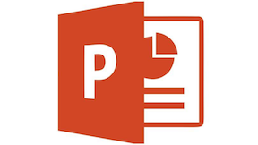

## R Markdown to PowerPoint



You can create PowerPoint presentations from R Markdown files using RStudio. Warning: This feature is experimental; do not attempt current or production systems. The following instructions have been tested for Linux.

### Install

#### Pandoc

[Pandoc](http://pandoc.org/) now has support the PowerPoint format (as of [v2.0.6](http://pandoc.org/releases.html)). The current version of RStudio (v1.1) bundles Pandoc v1, but the next major release of RStudio (v1.2) will bundle Pandoc 2. In the meantime, you will need to manually install and link to the latest version of Pandoc. *Warning: Changing the location of your Pandoc installation may break your code and your system; do not attempt unless you are comfortable with making changes to Pandoc.*

```
wget https://github.com/jgm/pandoc/releases/download/2.1.2/pandoc-2.1.2-linux.tar.gz
tar xzvf pandoc-2.1.2-linux.tar.gz
ln -s /opt/pandoc-2.1.2/bin/pandoc /usr/local/bin/pandoc
```

#### R packages

You should also upgrade the rmarkdown and knitr packages. You will want to install the webshot package so you can take screenshots of your Shiny apps and include them in your presentations.

```
install.packages('rmarkdown')
install.packages('knitr')
install.packages("webshot")
webshot::install_phantomjs()
```

#### RStudio 1.2 [optional]

RStudio v1.2 contains additional user features for creating PowerPoint presentations. Currently, the features RStudio v1.2 will recognize Pandoc 2 if it already installed. You will still need to manually install Pandoc v2 in order to see the PowerPoint features in RStudio v1.2. You can upgrade to the latest version of RStudio by downloading and installing the [daily builds](https://dailies.rstudio.com/). *Warning: RStudio v1.2 is still in development; if you want to test PowerPoint with a stable release then use Pandoc v2 with RStudio v1.1.*

### Demos

This package contains demos for creating PowerPoint presentations from R Markdown. All standard markdown format is supported in the PowerPoint output, as well as some nice features, including:

* Bullets and numbering
* Multiple columns
* Linked images
* Equations
* Code
* Text formatting
* Tables
* Templates

See the [Pandoc manual](http://pandoc.org/MANUAL.html) for specific support options. Note that if you want to change the slide dimensions or any other aesthetics, you should make those changes in the PowerPoint template.
